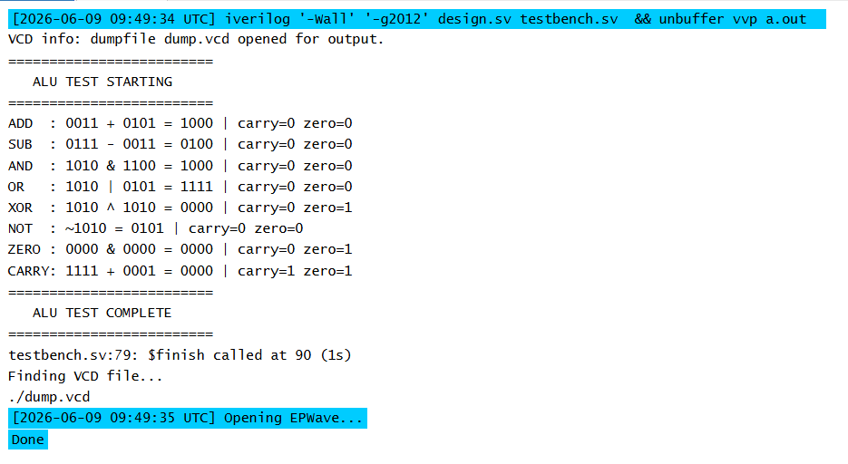

# 4-bit ALU Implementation in Verilog

## Overview
A 4-bit Arithmetic Logic Unit (ALU) implemented in Verilog
from scratch. Simulated using Icarus Verilog 12.0 on EDA
Playground. The ALU supports 6 arithmetic and logical
operations with zero and carry flag outputs.

## What is an ALU?
An ALU (Arithmetic Logic Unit) is the core component of
every processor. It performs all arithmetic and logical
operations inside a CPU. This project implements a
simplified 4-bit ALU demonstrating the fundamental
building block of digital processors.

## Module Description

### alu.v
Takes two 4-bit inputs A and B and a 3-bit selector SEL.
Performs the selected operation and outputs the 4-bit
result along with zero and carry flags.

### Inputs and Outputs
| Port | Width | Direction | Description |
|---|---|---|---|
| A | 4 bit | Input | First operand |
| B | 4 bit | Input | Second operand |
| SEL | 3 bit | Input | Operation selector |
| result | 4 bit | Output | Operation result |
| zero | 1 bit | Output | High when result is 0000 |
| carry | 1 bit | Output | High when addition overflows |

## Supported Operations
| SEL | Operation | Description |
|---|---|---|
| 000 | ADD | A + B with carry output |
| 001 | SUB | A - B |
| 010 | AND | Bitwise AND of A and B |
| 011 | OR | Bitwise OR of A and B |
| 100 | XOR | Bitwise XOR of A and B |
| 101 | NOT | Bitwise NOT of A |

## Key Concepts
- Combinational logic design using always block
- Case statement for operation selection
- Carry flag using concatenation operator
- Zero flag using conditional assignment
- Difference between combinational and sequential logic

## Simulation Output

## Tools Used
- EDA Playground — browser based Verilog simulation
- Icarus Verilog 12.0 — open source Verilog simulator
- EPWave — online waveform viewer
- GitHub — version control and project portfolio

## How to Run
1. Go to edaplayground.com
2. Create new playground
3. Select Icarus Verilog 12.0
4. Paste alu.v in design.sv
5. Paste tb_alu.v in testbench.sv
6. Click Run

## Author
Bhoomi Varshney

ECE Student — Chandigarh University
